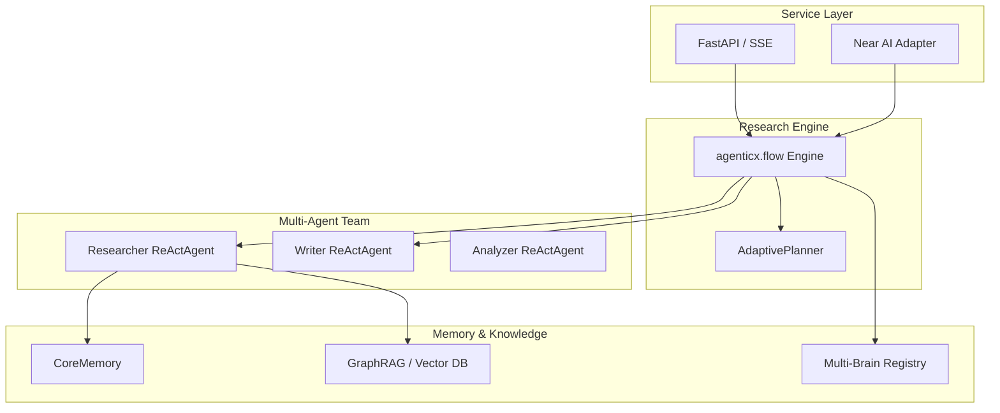

# AgenticX-DeepResearch 深度调研智能体演进计划

## 现状

原始的 `AgenticX-DeepResearch` 是一个基于旧版 AgenticX 的同步脚本，逻辑硬编码在巨型文件中，缺乏动态规划、长程记忆和标准化的通信协议。通过前三个阶段的重构，我们已经完成了核心引擎的现代化改造。

## 核心架构

### 智能体层 (Agents)
- **ReActAgent**: 所有的调研智能体均升级为异步 ReAct 架构，具备原生的工具调用和自我反思能力。
- **AdaptivePlanner**: 负责动态维护执行计划（ExecutionPlan），根据调研发现实时修补计划。

### 工作流层 (Flow)
- **声明式工作流**: 使用 `agenticx.flow` 替代硬编码循环，支持复杂的条件路由和循环检测。
- **状态管理**: 统一的 `ResearchState` 贯穿整个调研生命周期。

### 知识与记忆层 (Knowledge & Memory)
- **GraphRAG**: 将非结构化调研成果自动转换为知识图谱，实现知识的结构化沉淀。
- **多脑协同**: 挂载不同领域的“知识脑”，提供专业背景支撑。
- **长程记忆**: 记录调研决策路径，实现跨任务的经验复用。

## 演进路径

### Phase 1: 底层基建替换 (已完成)
- [x] 重构搜索引擎工具为 `BaseTool` 异步标准
- [x] 精简 `models.py` 数据模型
- [x] 更新 `requirements.txt` 对齐 AGX 依赖

### Phase 2: 智能体与工作流重塑 (已完成)
- [x] 升级 `QueryGenerator` 和 `ResearchSummarizer` 为 `ReActAgent`
- [x] 基于 `agenticx.flow` 重写 Basic/Advanced 工作流
- [x] 集成 `AdaptivePlanner` 实现动态重规划

### Phase 3: 知识库与记忆系统集成 (已完成)
- [x] 接入 `KnowledgeBase` 统一知识库接口
- [x] 实现 `Multi-Brain` 多脑协同逻辑
- [x] 集成 `CoreMemory` 记录调研反思
- [x] 实现 `GraphBuilder` 自动导出知识图谱

### Phase 4: 服务化与 Near AI 协议适配 (已完成)
- [x] **FastAPI 服务化**: 封装 Flow 接口，支持异步任务提交。
- [x] **SSE 流式输出**: 实现调研进度的实时推送。
- [x] **Near AI 对接**: 编写适配层，接入 Near Agent 协议。
- [x] **持久化层**: 引入数据库存储调研历史。

### Phase 5: 多模态与数字分身演进 (进行中)
- [ ] **多模态调研**: 支持图片、视频等非文本资料的调研分析。
- [ ] **可视化面板**: 构建前端仪表盘，直观展示调研过程与图谱。
- [ ] **身份认证**: 集成去中心化身份（DID），使 Agent 成为真正的数字分身。

---

## 涉及文件总表

### 核心引擎 (Engine)
- `flows/basic_flow.py`, `flows/advanced_flow.py`
- `agents/query_generator.py`, `agents/research_summarizer.py`
- `models.py`, `tools/base_search.py`

### 服务层 (Service - 待开发)
- `server/api.py`, `server/sse.py`
- `adapters/near_adapter.py`

### 存储层 (Storage - 待开发)
- `db/models.py`, `db/manager.py`
