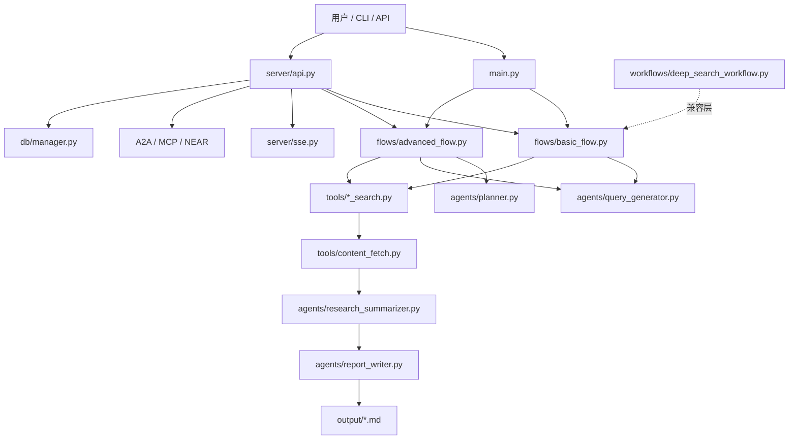

# AgenticX 深度搜索系统

一个基于 AgenticX 构建的深度研究助手。系统支持 Basic 与 Advanced 两种研究模式，集成搜索、内容抓取、总结、报告生成、协议服务与持久化能力，适合对复杂主题进行可追踪、可扩展的研究分析。

## 项目概述

本项目的主线已经从早期的单一 `workflows/unified_research_workflow.py` 演进为 `flows/` 驱动的 v2 架构：

- `BasicResearchFlow`: 面向明确问题的快速深度研究。
- `AdvancedResearchFlow`: 面向复杂主题的规划、搜索、总结、反思和收敛流程。
- `workflows/`: 保留兼容层与旧版深搜流程，便于历史代码迁移。
- `server/`: 提供 FastAPI、SSE、A2A、MCP 与 NEAR 适配能力。

## 核心特性

### 研究工作流

- **基础模式 (Basic)**: 生成多条搜索查询，抓取内容，汇总证据并输出研究报告。
- **高级模式 (Advanced)**: 引入规划、知识缺口识别、多轮搜索、并发总结和质量收敛。
- **Token 预算控制**: 通过 `token_budget.py` 对上下文、摘要和报告生成进行预算管理。
- **内容获取增强**: `tools/content_fetch.py` 提供 Jina Reader 兼容抓取、超时控制、回退与内容清洗。

### 智能体与工具

- **规划智能体**: 制定研究策略，识别知识缺口。
- **查询生成智能体**: 根据研究目标和上下文生成默认 10 条高覆盖查询。
- **研究总结智能体**: 并发分析搜索结果，抽取关键事实、风险和后续问题。
- **报告写作智能体**: 输出结构化 Markdown 研究报告。
- **搜索工具**: 支持 BochaaI、Bing、Google 与测试 Mock 场景。

### 协议与服务

- **FastAPI 服务**: `server/api.py` 提供 HTTP API。
- **SSE 事件流**: `server/sse.py` 支持流式研究进度。
- **A2A / MCP / NEAR 适配**: `server/near_adapter.py` 暴露协议兼容端点。
- **数据库管理**: `db/manager.py` 管理研究任务、事件和结果持久化。

## 系统架构



## 快速开始

### 1. 克隆项目

```bash
git clone https://github.com/DemonDamon/AgenticX-DeepResearch.git
cd AgenticX-DeepResearch
```

### 2. 安装依赖

```bash
pip install -r requirements.txt
```

### 3. 配置环境变量

```bash
cp env_template.txt .env
```

常用变量：

| 变量名 | 说明 | 必需 | 默认值 |
| --- | --- | --- | --- |
| `KIMI_API_KEY` | Kimi API 密钥 | 是 | - |
| `KIMI_API_BASE` | Kimi API 地址 | 否 | `https://api.moonshot.cn/v1` |
| `BOCHAAI_API_KEY` | BochaaI 搜索密钥 | 否 | - |
| `BING_API_KEY` | Bing Search 密钥 | 否 | - |
| `GOOGLE_API_KEY` | Google Search 密钥 | 否 | - |
| `SEARCH_ENGINE` | 搜索引擎选择 | 否 | `bochaai` |

### 4. 运行测试

```bash
python -m pytest -q
```

当前完整测试基线：`108 passed, 1 skipped`。

### 5. 运行研究

```bash
# 基础模式
python main.py "ChatGPT 对教育行业的影响" --mode basic

# 高级模式
python main.py "区块链技术应用" --mode advanced

# 不传 topic 时会进入命令行输入
python main.py
```

> 当前 `main.py` 仅支持 `basic` 与 `advanced` 两种模式。早期文档中的 `interactive` 参数和 `--max_research_loops` CLI 参数已经不再是当前入口能力。

## API 服务

```bash
uvicorn server.api:app --reload --host 0.0.0.0 --port 8000
```

服务层覆盖：

- 研究任务创建、查询和结果获取。
- 流式事件推送。
- A2A、MCP、NEAR 兼容协议端点。
- 能力矩阵与服务注册信息。

## 项目结构

```text
AgenticX-DeepResearch/
├── .plan/                         # 分阶段计划与 TDD 路线
├── .conclusions/                  # 架构与模块总结
├── agents/                        # 规划、查询、总结、报告等智能体
├── db/                            # 数据模型与数据库管理
├── docs/
│   ├── capability_matrix.md       # 能力矩阵
│   └── refactoring/               # 阶段重构报告
├── flows/                         # v2 Basic / Advanced Flow
├── interactive/                   # 交互和进度组件
├── report/                        # 引文、质量评估和报告构建
├── server/                        # FastAPI、SSE、协议适配
├── tests/                         # 单元、集成、协议和 P0 回归测试
├── tools/                         # 搜索、内容抓取、分析和验证工具
├── workflows/                     # 兼容工作流与旧版深搜流程
├── main.py                        # CLI 入口
├── models.py                      # 领域模型
├── token_budget.py                # Token 预算工具
├── config.yaml                    # 默认配置
├── env_template.txt               # 环境变量模板
├── requirements.txt               # Python 依赖
├── Dockerfile
└── DEPLOYMENT.md
```

## 文档索引

- [P0 Kimi Gap TDD Roadmap](.plan/2026-06-16-kimi-gap-tdd-roadmap.md): P0 能力补齐的分阶段计划。
- [Capability Matrix](docs/capability_matrix.md): 当前功能与协议能力矩阵。
- [Refactoring Reports](docs/refactoring/): Phase 1 到 Phase 6 的重构报告归档。
- [Deployment Guide](DEPLOYMENT.md): 部署说明。

## 配置说明

`config.yaml` 中的主要配置：

- `llm.provider`: LLM 提供者，默认 `kimi`。
- `llm.model`: 模型名称。
- `search.engine`: 搜索引擎，默认 `bochaai`。
- `deep_search.max_research_loops`: 深度搜索循环配置，主要供兼容工作流使用。
- `deep_search.max_search_results`: 每次搜索的最大结果数。

## 技术特色

| 特性 | 实现方式 | 优势 |
| --- | --- | --- |
| Flow 架构 | `flows/basic_flow.py` 与 `flows/advanced_flow.py` | 当前入口清晰，便于扩展 |
| 内容抓取 | Jina Reader 兼容抓取与回退策略 | 提升真实网页内容利用率 |
| 查询覆盖 | 默认 10 条查询生成 | 提升复杂主题召回率 |
| 并发总结 | 多来源结果并发处理 | 降低等待时间 |
| Token 预算 | `token_budget.py` | 控制上下文长度与成本 |
| 协议适配 | FastAPI + SSE + A2A + MCP + NEAR | 支持服务化集成 |
| 测试闭环 | 单元、集成、协议和 P0 回归测试 | 变更可验证 |

## 故障排除

1. **API 密钥错误**: 检查 `.env` 中的 `KIMI_API_KEY`。
2. **搜索无结果**: 确认 `SEARCH_ENGINE` 与对应 API Key 是否匹配。
3. **Bing 搜索失败**: 当前代码读取 `BING_API_KEY`，不要只配置旧名 `BING_SUBSCRIPTION_KEY`。
4. **内容抓取超时**: 检查网络环境，系统会自动进行回退处理。
5. **测试产生本地文件**: `research.db`、`output/` 和 `.DS_Store` 属于本地运行产物，不应提交。

## 测试和验证

```bash
# 完整测试
python -m pytest -q

# 只运行 P0 能力回归
python -m pytest tests/test_p0_gap_closure.py -q

# 只运行服务协议测试
python -m pytest tests/test_server_v1.py tests/test_phase6_protocols.py -q
```

## License

MIT License
